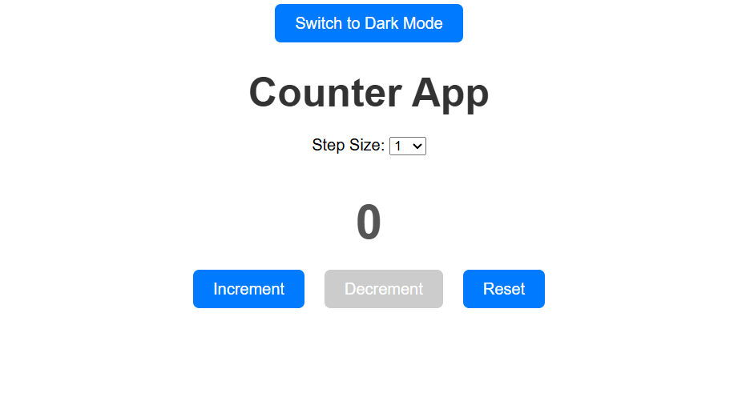

# 🚀 Counter App

A simple and interactive counter application built with React.js.  
Includes features like Step Size Control, Dark Mode, Reset Button, and more!

---

## 📸 Project Preview



> Live Demo: [View Counter App](https://your-custom-url.vercel.app/)

---

## ✨ Features

- Increment and Decrement Counter
- Step Size Selection
- Reset Counter to Zero
- Disable Decrement Button at Zero
- Dark Mode Toggle (Light/Dark Theme)
- Save Counter Value to LocalStorage
- Responsive and Minimal UI Design

---

## 🛠️ Built With

- React.js
- HTML5
- CSS3
- JavaScript (ES6)

---

## 🔗 Deployed On

[](https://counter-app-with-react-js-karthikreddy.vercel.app/)

---

## 📂 Project Setup

To run this project locally:

```bash
git clone https://github.com/karthikreddymarla/counter-app-with-react.js.git
cd counter-app
npm install
npm start
```
